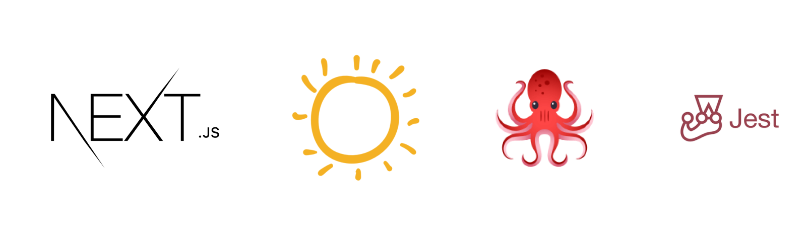

<h1 align="center">
  
</h1>

<div align="center">

<!-- Badges -->


</div>

---

<div align="center">
  <a href="#dart-about">:dart:&nbsp;&nbsp;About</a> &nbsp; | &nbsp; 
  <a href="#rocket-technologies">:rocket:&nbsp;&nbsp;Technologies</a> &nbsp; | &nbsp;
  <a href="#white_check_mark-requirements">:white_check_mark:&nbsp;&nbsp;Requeriments</a> &nbsp; | &nbsp;
  <a href="#checkered_flag-starting">:checkered_flag:&nbsp;&nbsp;Starting</a>
</div>

<br>

## :dart: Sobre ##

Testing SunEditor with [react-testing-library](https://testing-library.com/) and [Jest](https://jestjs.io/);

## :rocket: Technologies ##

This project was developed with the following technologies:

- [Next.js](https://nextjs.org/)
- [TypeScript](https://www.typescriptlang.org/)
- [SunEditor](http://suneditor.com/)
- [Jest](https://jestjs.io/)
- [React Testing Library](https://testing-library.com)
- [Identity Obj Proxy](https://github.com/keyz/identity-obj-proxy)

## :white_check_mark: Requirements ##

- [Git](https://git-scm.com/)
- [Node](https://nodejs.org/en/)
- [Yarn](https://yarnpkg.com/lang/en/)

## :checkered_flag: Starting ##

```bash
# Clone this project
$ git clone git@github.com:KaiqueCovo/suneditor-testing.git

# Go into the repository
$ cd suneditor-testing

# Install dependencies
$ yarn install

# Run testing
$ yarn test

# Run the project
$ yarn dev
```

---
Made with ♥  by [Kaique Covo](https://www.linkedin.com/in/kaique-covo-a46331147/) :wave: